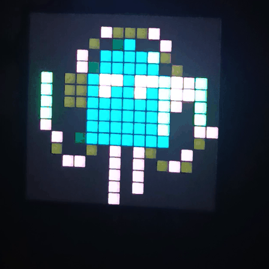
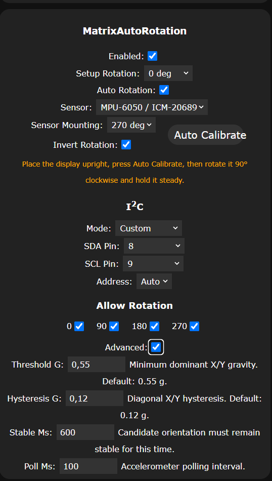

# WLED Matrix Auto Rotation

**Version:** `0.1.0`  
**Status:** stable release; core rotation, calibration, Shared/Custom I²C and runtime sensor recovery hardware-validated

A standalone WLED usermod that automatically rotates the **final 2D matrix raster** according to an accelerometer, without changing effect or segment state.

<p align="center">
  
</p>

## Features

- 0° / 90° / 180° / 270° automatic matrix rotation.
- Configurable base (`Setup Rotation`) and sensor mounting rotation.
- Guided `Auto Calibrate` helper that learns sensor mounting orientation and rotation direction from a 90° clockwise turn, without changing `Setup Rotation`.
- Optional `Invert Rotation` for sensor boards mounted on the opposite face of the enclosure.
- Per-orientation allow mask.
- Threshold, hysteresis, stable time and polling controls under `Advanced`.
- LIS3DH backend.
- MPU-6050 / ICM-20689 backend.
- Matrix Portal, Shared and Custom I²C modes.
- No third-party accelerometer library required.
- PlatformIO-ready out-of-tree WLED usermod.

## Architecture

Rotation is applied in `handleOverlayDraw()` after WLED has composited the logical matrix raster and before WLED performs its logical-to-physical LED mapping/output.

```text
WLED effects / segments
        |
        v
final logical raster
        |
        v
Matrix Auto Rotation
        |
        v
WLED ledmap / physical mapping
        |
        v
LED output
```

The usermod therefore does not rotate individual effects, modify segment state, or replace WLED's physical ledmap.

## Rotation model

The configured setup rotation is the installation reference:

```text
effective = setupRotation + autoRotation  (mod 360)
```

Sensor mounting compensates for a sensor installed at a different quarter-turn angle from the display:

```text
autoRotation = rawSensorRotation - sensorMounting  (mod 360)
```

If `Invert Rotation` is enabled, only the automatic component is mirrored before it is added to the setup rotation:

```text
autoRotation = -autoRotation  (mod 360)
```

This keeps 0° and 180° unchanged while swapping 90° and 270°. It is intended for installations where the accelerometer board is fixed to the opposite face (for example, back-to-back with the enclosure rather than back-to-back with the LED matrix). `Setup Rotation` remains the installation reference in both cases.

The Matrix Portal axis convention validated on hardware is:

| Physical panel orientation | Gravity direction | Auto rotation |
| --- | --- | --- |
| 0° | +Y | 0° |
| 90° clockwise | +X | 90° |
| 180° | -Y | 180° |
| 270° clockwise | -X | 270° |

Qualified defaults are **0.55 g** threshold, **0.12 g** hysteresis, **600 ms** stable time and **100 ms** polling. If neither X nor Y dominates sufficiently, the last stable orientation is preserved; Z is not used to invent an orientation while the panel is nearly flat.

## Supported sensors

| Sensor | Addresses | Status |
| --- | --- | --- |
| LIS3DH | `0x19`, `0x18` | **Hardware-tested** on Matrix Portal S3 |
| ICM-20689 | `0x68`, `0x69`; `WHO_AM_I 0x98` | **Hardware-tested** on ESP32-C3 |
| MPU-6050 | `0x68`, `0x69`; `WHO_AM_I 0x68/0x69` | Implemented; dedicated hardware test pending |

Both backends use a ±2 g accelerometer range and a 50 Hz sensor cadence. The ICM-20689 backend configures its dedicated accelerometer DLPF register as required.

> Some modules sold as GY-521/MPU-6050 may contain a compatible device such as ICM-20689. WLED Info reports the detected chip and `WHO_AM_I` value.

## I²C modes

| Mode | Behavior | Typical use |
| --- | --- | --- |
| **Matrix Portal** | Initializes the board-default `Wire` bus and probes the sensor address automatically | Matrix Portal S3 / onboard LIS3DH |
| **Shared** | Uses WLED's already initialized global `Wire` bus without changing pins, clock or ownership | Multiple I²C devices on the same SDA/SCL pair |
| **Custom** | Uses configured SDA/SCL pins; explicit or automatic sensor address | Dedicated/custom wiring |

### Shared I²C

`Shared` is deliberately non-owning: MAR does not reserve SDA/SCL, call `Wire.begin()`/`Wire.end()`, change pins, or change the bus clock. If the bus owner initializes after MAR, sensor initialization is retried automatically.

This mode has been hardware-tested on ESP32-C3 with both devices on the same physical bus:

- PAJ7620 at `0x73`;
- ICM-20689 at `0x68`.

Both operate concurrently because their addresses differ.

On single-controller devices such as ESP32-C3, use `Shared` when another WLED component already owns the I²C bus. `Custom` necessarily rebinds that controller to the selected pins.

## Configuration UI

Open **Config → Usermods → MatrixAutoRotation**.



`Auto Calibrate` appears beside `Sensor Mounting:`. It is enabled only when the already-configured sensor is detected and the current upright orientation is stable. Place the display upright, press the button, then rotate the display **90° clockwise** and hold it steady. MAR determines the required `Sensor Mounting` and whether `Invert Rotation` must be enabled, then updates those two controls. `Setup Rotation` is deliberately left untouched because it is an independent visual raster offset. The normal WLED **Save** button still commits the changes.

If `Sensor`, I²C mode, SDA/SCL or address are changed but not yet saved, `Auto Calibrate` is disabled because the running firmware is still using the previous hardware configuration. Calibration times out after 15 seconds and never changes settings on failure.

`Invert Rotation:` appears directly below `Sensor Mounting:`. The four detection/timing parameters are hidden until `Advanced:` is enabled. `Allow Rotation` controls which quarter-turn orientations may be accepted; at least one orientation is always retained.

The screenshot shows the current hardware-tested two-column calibration layout. Available I²C modes are `Matrix Portal`, `Shared` and `Custom`.

## Rectangular matrices

A 90°/270° rotation swaps width and height. MAR deliberately does not crop, resize or mutate WLED's matrix geometry, so final quarter-turns are valid only on square matrices.

- square matrices support final 0° / 90° / 180° / 270°;
- rectangular matrices support final 0° / 180° only;
- if the composed `Setup Rotation + Auto Rotation` requests 90° or 270° on a rectangular matrix, MAR blocks that final quarter-turn and applies the unrotated raster instead;
- WLED Info reports both the **requested** and **applied** rotation, so the fallback is explicit rather than silent.

`Sensor Mounting`, `Invert Rotation` and the automatic orientation engine are not altered by this guard. Only the final raster rotation is constrained by matrix geometry.

## PlatformIO / WLED integration

The repository is an out-of-tree WLED usermod using `library.json` and `REGISTER_USERMOD()`.

Example `platformio_override.ini` entry:

```ini
[env:matrix_auto_rotation_test]
extends = env:YOUR_WORKING_WLED_ENV
custom_usermods =
  ${env:YOUR_WORKING_WLED_ENV.custom_usermods}
  symlink:///absolute/path/to/wled-usermod-matrix-auto-rotation
```

Build and upload with:

```bash
pio run -e matrix_auto_rotation_test
pio run -e matrix_auto_rotation_test -t upload
```

See [`docs/PLATFORMIO.md`](docs/PLATFORMIO.md) and `platformio_override.ini.sample`.

## Runtime sensor recovery

MAR continuously monitors successful accelerometer reads. Three consecutive read failures mark the sensor offline. The last valid rotation remains applied, so a temporary sensor/cable failure never rotates the display unexpectedly.

While offline, MAR retries sensor initialization every 60 seconds and resumes automatically when the device becomes available again. Shared I²C has a short fast-retry window during boot only, to tolerate WLED/usermod initialization order.

## WLED Info diagnostics

The usermod reports:

- build/version and status;
- runtime state (`enabled`, auto-rotation state and sensor readiness);
- I²C mode plus effective bus configuration;
- detected sensor, address and device ID;
- live X/Y/Z acceleration;
- complete orientation pipeline: stable axis, raw rotation, sensor mounting, inversion, automatic rotation, setup rotation, **requested** final rotation and **applied** final rotation;
- runtime health counters: successful reads, read errors, consecutive errors, disconnects, reconnects and last-good sample age;
- reconnect state and time until the next retry while offline;
- active threshold/hysteresis/stable/poll filter values;
- allowed automatic orientations;
- matrix geometry, square/rectangular capability and blocked-quarter-turn diagnostics.

These fields are intended to make sensor wiring and orientation qualification possible without adding debug code.

## Hardware validation matrix

| Function | Hardware | Result |
| --- | --- | --- |
| LIS3DH detection and XYZ | Matrix Portal S3 | PASS |
| Automatic 0/90/180/270 rotation | Matrix Portal S3 + LIS3DH | PASS |
| Setup Rotation composition | Matrix Portal S3 + LIS3DH | PASS |
| Invert Rotation direction swap | ESP32-C3 + ICM-20689 | PASS |
| ICM-20689 detection and XYZ | ESP32-C3 | PASS |
| Automatic rotation | ESP32-C3 + ICM-20689 | PASS |
| Custom I²C on single-controller ESP32 | ESP32-C3 | PASS |
| Shared I²C coexistence | ESP32-C3 + PAJ7620 + ICM-20689 | PASS |
| Runtime disconnect/reconnect recovery | ESP32-C3 + ICM-20689 | **PASS** |
| Auto Calibrate mounting + direction | ESP32-C3 + ICM-20689, current inverted-face installation | PASS |
| Two-column calibration UI | ESP32-C3 / WLED desktop UI | PASS |
| MPU-6050-specific hardware | — | Pending |

## Known limitations

- Per-pixel WLED CCT metadata is not rotated. This does not affect the tested RGB matrix targets.
- Orientation is derived from X/Y gravity only; Z is intentionally ignored for orientation selection.
- MPU-6050 support is implemented but has not yet been qualified on a confirmed MPU-6050 device.
- 90°/270° output on rectangular matrices is intentionally blocked because MAR does not alter WLED matrix geometry.

## Origin of the orientation algorithm

The orientation classifier and Matrix Portal axis convention are derived from the hardware-tested `IDotMatrix-ESP32-Emulator 0.6.0-dev Build 164` used during development. Its threshold/hysteresis/stability behavior and output-to-source rotation convention were retained.

## License

MIT. See [`LICENSE`](LICENSE).

